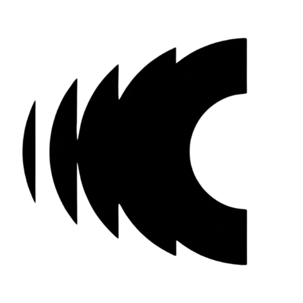

<div align="center">

<picture>
  <source media="(prefers-color-scheme: dark)" srcset="./src/assets/usdp-logo-white.png">
  
</picture>

# BASEUSDP

**Privacy-First Payments for the AI Economy.**

Confidential transactions powered by Zero-Knowledge Proofs.
x402 payments that keep your financial data encrypted — always.

[](https://www.base.org)
[](https://www.x402.org)
[](https://opensource.org/licenses/MIT)
[](https://x.com/UsdpBase)

[Live App](https://baseusdp.com) · [Twitter](https://x.com/UsdpBase) · [Docs](https://www.baseusdp.com/docs)

</div>

---

## Overview

BASEUSDP is a privacy-first payments layer built for the **Web4 agentic economy** — where AI agents, not just humans, are primary economic actors. We enable confidential money movement and machine-to-machine commerce on Base, without exposing balances, amounts, counterparties, or links to your main wallet.

Everything we ship is engineered around a single principle: **financial activity should be verifiable, not visible.**

## Why BASEUSDP

Public blockchains are radically transparent. Every payment, balance, and behavioral pattern is permanently indexed. For humans this is uncomfortable; for autonomous agents executing strategy at scale, it is a structural risk.

BASEUSDP solves this with cryptographic privacy guarantees layered on top of Base, paired with the x402 payment standard for native, internet-scale value exchange.

## Features

- **Private Transfers** — Send funds with encrypted amounts and confidential recipients
- **Private Online Payments** — Pay for content, APIs, and services using the x402 standard
- **Encrypted Balances** — Your balance is private; you choose what is disclosed and to whom
- **Agentic-Ready** — Purpose-built primitives so AI agents can transact autonomously and confidentially
- **Base-Native** — Low fees, fast finality, Ethereum-grade security
- **Privacy by Default** — No opt-in toggles, no leaked metadata, no spending pattern tracking

## Technology

### Zero-Knowledge Proofs (ZKPs)

ZKPs are the cryptographic engine of BASEUSDP. They let the network verify that a transaction is valid — correct balance, valid signature, no double-spend — *without* revealing the amount, the sender, or the receiver. This is the same class of math that makes modern privacy-preserving systems possible, applied to everyday payments.

### x402 — The Internet-Native Payment Standard

The x402 protocol revives HTTP status code `402 Payment Required` as the language of machine-to-machine commerce. With x402, an API, an article, or a service can natively demand payment as part of a request — and BASEUSDP wallets can answer that demand programmatically, privately, and instantly. This is what makes the agentic economy actually transact.

### Built on Base

Base is Ethereum's leading L2 — low fees, high throughput, and the security guarantees of Ethereum. BASEUSDP runs natively on Base so confidential payments stay fast, cheap, and battle-tested.

### Frontend

- **React + Vite + TypeScript** — modern, type-safe, fast
- **Tailwind CSS** + **shadcn/ui** — design system primitives
- **Framer Motion** — interaction and motion design
- **wagmi / viem** — Ethereum wallet and contract interaction

## Use Cases

| Audience | What BASEUSDP unlocks |
|---|---|
| **Individuals** | Send and receive money on Base without broadcasting amounts to the world |
| **Creators & APIs** | Charge per request with x402 — no accounts, no card processors, just payments |
| **AI Agents** | Autonomous wallets that can pay, get paid, and execute strategy without leaking position |
| **Businesses** | Settle B2B payments on-chain with confidential amounts and counterparties |

## Getting Started

### Prerequisites

- Node.js 18+
- A modern browser with a Web3 wallet (MetaMask, Coinbase Wallet, etc.)

### Run locally

```bash
git clone https://github.com/BaseUsdp/BaseUSDP.git
cd BaseUSDP
npm install
npm run dev
```

The dev server starts on [http://localhost:5173](http://localhost:5173).

### Build for production

```bash
npm run build
npm run preview
```

## Project Structure

```
.
├── src/
│   ├── components/     UI components and dashboard
│   ├── pages/          Route-level pages
│   ├── contexts/       Wallet and app-wide providers
│   ├── services/       Client-side service layer
│   └── assets/         Brand assets and images
├── public/             Static assets served at root
└── index.html          Application entry
```

## Community

- **Website** — [baseusdp.com](https://baseusdp.com)
- **Twitter / X** — [@UsdpBase](https://x.com/UsdpBase)
- **Farcaster** — [@baseusdp](https://farcaster.xyz/baseusdp)

## License

Released under the [MIT License](./LICENSE).

---

<div align="center">
  <sub>Built with privacy in mind, on <a href="https://www.base.org">Base</a>.</sub>
</div>
